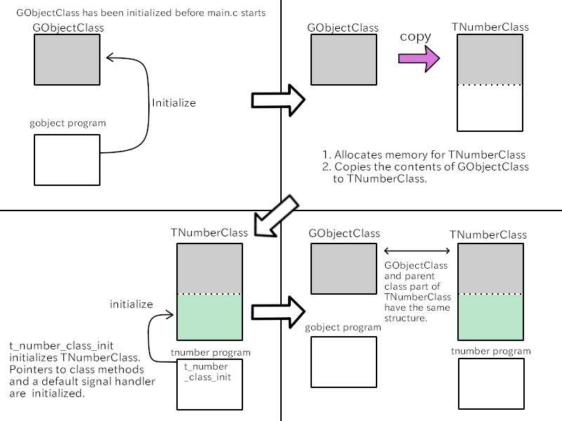
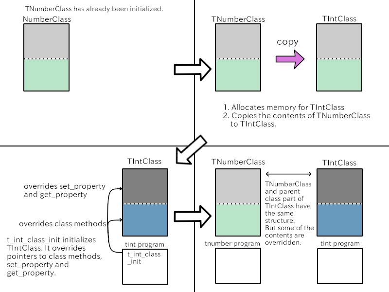

Up: [Readme.md](../Readme.md),  Prev: [Section 5](sec5.md), Next: [Section 7](sec7.md)

# Derivable type and abstract type

## Derivable type

There are two kinds of types, final type and derivable type.
Final type doesn't have any child object.
Derivable type has child objects.

The main difference between two objects above is their class.
Final type objects doesn't have its own class area.
The only member of the class is its parent class.

Derivable object has its own area in the class.
The class is open to its descendants.

`G_DECLARE_DERIVABLE_TYPE` is used to declare derivable type.
It is written in a header file like this:

~~~C
#define T_TYPE_NUMBER             (t_number_get_type ())
G_DECLARE_DERIVABLE_TYPE (TNumber, t_number, T, NUMBER, GObject)
~~~

## Abstract type

Abstract type doesn't have any instance.
This type of object is derivable and its children can use functions and signals of the abstract object.

The example of this section is TNumber, TInt and TDouble object.
TInt and TDouble have already made in the previous section.
They represent integer and floating point respectively.
Numbers are more abstract than integer and floating point.

TNumber is an abstract object which represents numbers.
TNumber is a parent object of TInt and TDouble.
TNumber isn't instantiated because it's abstract type.
When an instance is TNumber type, it is an instance of TInt or TDouble as well.

TInt and TDouble have five operations: addition, subtraction, multiplication, division and unary minus operation.
Those operations can be defined on TNumber object.

In this section we will define TNumber object and five functions above.
In addition `to_s` function will be added.
It converts the value of TNumber into a string.
It is like sprintf function.
And we will rewrite TInt and TDouble to implement the functions.

## TNumber object

`tnumber.h` is a header file for TNumber object.

~~~C
 1 #ifndef __T_NUMBER_H__
 2 #define __T_NUMBER_H__
 3 
 4 #include <glib-object.h>
 5 
 6 #define T_TYPE_NUMBER             (t_number_get_type ())
 7 G_DECLARE_DERIVABLE_TYPE (TNumber, t_number, T, NUMBER, GObject)
 8 
 9 struct _TNumberClass {
10   GObjectClass parent_class;
11   TNumber* (*add) (TNumber *self, TNumber *other);
12   TNumber* (*sub) (TNumber *self, TNumber *other);
13   TNumber* (*mul) (TNumber *self, TNumber *other);
14   TNumber* (*div) (TNumber *self, TNumber *other);
15   TNumber* (*uminus) (TNumber *self);
16   char * (*to_s) (TNumber *self);
17   /* signal */
18   void (*div_by_zero) (TNumber *self);
19 };
20 
21 /* arithmetic operator */
22 /* These operators create a new instance and return a pointer to it. */
23 TNumber *
24 t_number_add (TNumber *self, TNumber *other);
25 
26 TNumber *
27 t_number_sub (TNumber *self, TNumber *other);
28 
29 TNumber *
30 t_number_mul (TNumber *self, TNumber *other);
31 
32 TNumber *
33 t_number_div (TNumber *self, TNumber *other);
34 
35 TNumber *
36 t_number_uminus (TNumber *self);
37 
38 char *
39 t_number_to_s (TNumber *self);
40 #endif /* __T_NUMBER_H__ */
41 
~~~

- 7: `G_DECLARE_DERIVABLE_TYPE` macro.
This is similar to `G_DECLARE_FINAL_TYPE` macro.
The difference is the object is derivable or final.
`G_DECLARE_DERIVABLE_TYPE` is expanded to:
  - Declaration of `t_number_get_type ()` function. This function must be defined in `tnumber.c` file. The definition is usually done with `G_DEFINE_TYPE` or its family macros.
  - Definition of TNumber instance, whose member is its parent only.
  - Declaration of TNumberClass. It should be defined later in the header file.
  - Convenience macros `T_NUMBER` (cast to instance), `T_NUMBER_CLASS` (cast to class), `T_IS_NUMBER` (instance check), `T_IS_NUMBER_CLASS` (class check) and `T_NUMBER_GET_CLASS` are defined.
  - `g_autoptr()` support.
- 9-19: Definition of the structure of TNumberClass.
- 11-16: These are pointers to functions.
They are called class methods or virtual functions.
They are expected to be overridden by a function in the descendant object.
The methods are five arithmetic operators and `to_s` function.
`to_s` function is similar to sprintf function.
- 18: A pointer to the default signal handler of "div-by-zero" signal.
The offset of this pointer is given to `g_signal_new` as an argument.
- 21-40: Functions. They are public.

`tnumber.c` is below.

~~~C
 1 #include "tnumber.h"
 2 
 3 static guint t_number_signal;
 4 
 5 G_DEFINE_ABSTRACT_TYPE (TNumber, t_number, G_TYPE_OBJECT)
 6 
 7 static void
 8 div_by_zero_default_cb (TNumber *self) {
 9   g_print ("\nError: division by zero.\n\n");
10 }
11 
12 static void
13 t_number_class_init (TNumberClass *class) {
14 
15   /* virtual functions */
16   class->add = NULL;
17   class->sub = NULL;
18   class->mul = NULL;
19   class->div = NULL;
20   class->uminus = NULL;
21   class->to_s = NULL;
22   /* default signal handler */
23   class->div_by_zero = div_by_zero_default_cb;
24   /* signal */
25   t_number_signal =
26   g_signal_new ("div-by-zero",
27                 G_TYPE_FROM_CLASS (class),
28                 G_SIGNAL_RUN_LAST | G_SIGNAL_NO_RECURSE | G_SIGNAL_NO_HOOKS,
29                 G_STRUCT_OFFSET (TNumberClass, div_by_zero),
30                 NULL /* accumulator */,
31                 NULL /* accumulator data */,
32                 NULL /* C marshaller */,
33                 G_TYPE_NONE /* return_type */,
34                 0     /* n_params */
35                 );
36 }
37 
38 static void
39 t_number_init (TNumber *inst) {
40 }
41 
42 TNumber *
43 t_number_add (TNumber *self, TNumber *other) {
44   g_return_val_if_fail (T_IS_NUMBER (self), NULL);
45   g_return_val_if_fail (T_IS_NUMBER (other), NULL);
46 
47   TNumberClass *class = T_NUMBER_GET_CLASS(self);
48   return class->add ? class->add (self, other) : NULL;
49 }
50 
51 TNumber *
52 t_number_sub (TNumber *self, TNumber *other) {
53   g_return_val_if_fail (T_IS_NUMBER (self), NULL);
54   g_return_val_if_fail (T_IS_NUMBER (other), NULL);
55 
56   TNumberClass *class = T_NUMBER_GET_CLASS(self);
57   return class->sub ? class->sub (self, other) : NULL;
58 }
59 
60 TNumber *
61 t_number_mul (TNumber *self, TNumber *other) {
62   g_return_val_if_fail (T_IS_NUMBER (self), NULL);
63   g_return_val_if_fail (T_IS_NUMBER (other), NULL);
64 
65   TNumberClass *class = T_NUMBER_GET_CLASS(self);
66   return class->mul ? class->mul (self, other) : NULL;
67 }
68 
69 TNumber *
70 t_number_div (TNumber *self, TNumber *other) {
71   g_return_val_if_fail (T_IS_NUMBER (self), NULL);
72   g_return_val_if_fail (T_IS_NUMBER (other), NULL);
73 
74   TNumberClass *class = T_NUMBER_GET_CLASS(self);
75   return class->div ? class->div (self, other) : NULL;
76 }
77 
78 TNumber *
79 t_number_uminus (TNumber *self) {
80   g_return_val_if_fail (T_IS_NUMBER (self), NULL);
81 
82   TNumberClass *class = T_NUMBER_GET_CLASS(self);
83   return class->uminus ? class->uminus (self) : NULL;
84 }
85 
86 char *
87 t_number_to_s (TNumber *self) {
88   g_return_val_if_fail (T_IS_NUMBER (self), NULL);
89 
90   TNumberClass *class = T_NUMBER_GET_CLASS(self);
91   return class->to_s ? class->to_s (self) : NULL;
92 }
93 
~~~

- 5: `G_DEFINE_ABSTRACT_TYPE` macro.
This macro is used to define an abstract type object.
Abstract type isn't instantiated.
This macro is expanded to:
  - Declaration of `t_number_init ()` function.
  - Declaration of `t_number_class_init ()` function.
  - Definition of `t_number_get_type ()` function.
  - Definition of `t_number_parent_class` static variable that points the parent class.
- 3, 7-10, 25-35: Defines division-by-zero signal.
`div_by_zero_default_cb` is a default handler of "div-by-zero" signal.
Default handler doesn't have user data parameter.
`g_signal_new` is used instead of `g_signal_new_class_handler`.
`g_signal_new` specifies a handler as the offset from the top of the class to the pointer to the handler.
- 12-36: `t_number_class_init`.
- 16-21: These class methods are virtual functions.
They are expected to be overridden in the descendant object of TNumber.
NULL is assigned here so that nothing happens when the methods are called.
- 23: Assigns the address of the function `dev_by_zero_default_cb` to `class->div_by_zero`.
This is the default handler of "div-by-zero" signal.
- 38-40: `t_number_init` is a initialization function for an instance.
But abstract object isn't instantiated.
So, nothing is done in this function.
But you can't leave out the definition of this function.
- 42-92: Public functions.
These functions just call the corresponding class methods if the pointer to the class method is not NULL.

## TInt object.

`tint.h` is a header file of TInt object.
TInt is a child object of TNumber.

~~~C
 1 #ifndef __T_INT_H__
 2 #define __T_INT_H__
 3 
 4 #include <glib-object.h>
 5 #include "tnumber.h"
 6 
 7 #define T_TYPE_INT  (t_int_get_type ())
 8 G_DECLARE_FINAL_TYPE (TInt, t_int, T, INT, TNumber)
 9 
10 /* create a new TInt instance */
11 TInt *
12 t_int_new_with_value (int value);
13 
14 TInt *
15 t_int_new (void);
16 #endif /* __T_INT_H__ */
17 
~~~

- 10-16:Declares public functions.
Arithmetic functions and `to_s` are declared in TNumber, so TInt doesn't declare those functions.
Only instance creation functions are declared.

`tint.c` implements virtual functions (class methods).
And the pointers of the methods in TNumberClass are rewritten here.

~~~C
  1 #include "tint.h"
  2 #include "tdouble.h"
  3 
  4 #define PROP_INT 1
  5 static GParamSpec *int_property = NULL;
  6 
  7 struct _TInt {
  8   TNumber parent;
  9   int value;
 10 };
 11 
 12 G_DEFINE_TYPE (TInt, t_int, T_TYPE_NUMBER)
 13 
 14 static void
 15 t_int_set_property (GObject *object, guint property_id, const GValue *value, GParamSpec *pspec) {
 16   TInt *self = T_INT (object);
 17 
 18   if (property_id == PROP_INT) {
 19     self->value = g_value_get_int (value);
 20   } else
 21     G_OBJECT_WARN_INVALID_PROPERTY_ID (object, property_id, pspec);
 22 }
 23 
 24 static void
 25 t_int_get_property (GObject *object, guint property_id, GValue *value, GParamSpec *pspec) {
 26   TInt *self = T_INT (object);
 27 
 28   if (property_id == PROP_INT)
 29     g_value_set_int (value, self->value);
 30   else
 31     G_OBJECT_WARN_INVALID_PROPERTY_ID (object, property_id, pspec);
 32 }
 33 
 34 static void
 35 t_int_init (TInt *d) {
 36 }
 37 
 38 /* arithmetic operator */
 39 /* These operators create a new instance and return a pointer to it. */
 40 #define t_int_binary_op(op) \
 41   int i; \
 42   double d; \
 43   if (T_IS_INT (other)) { \
 44     g_object_get (T_INT (other), "value", &i, NULL); \
 45     return  T_NUMBER (t_int_new_with_value (T_INT(self)->value op i)); \
 46   } else { \
 47     g_object_get (T_DOUBLE (other), "value", &d, NULL); \
 48     return  T_NUMBER (t_int_new_with_value (T_INT(self)->value op (int) d)); \
 49   }
 50 
 51 static TNumber *
 52 t_int_add (TNumber *self, TNumber *other) {
 53   g_return_val_if_fail (T_IS_INT (self), NULL);
 54 
 55   t_int_binary_op (+)
 56 }
 57 
 58 static TNumber *
 59 t_int_sub (TNumber *self, TNumber *other) {
 60   g_return_val_if_fail (T_IS_INT (self), NULL);
 61 
 62   t_int_binary_op (-)
 63 }
 64 
 65 static TNumber *
 66 t_int_mul (TNumber *self, TNumber *other) {
 67   g_return_val_if_fail (T_IS_INT (self), NULL);
 68 
 69   t_int_binary_op (*)
 70 }
 71 
 72 static TNumber *
 73 t_int_div (TNumber *self, TNumber *other) {
 74   g_return_val_if_fail (T_IS_INT (self), NULL);
 75   int i;
 76   double d;
 77 
 78   if (T_IS_INT (other)) {
 79     g_object_get (T_INT (other), "value", &i, NULL);
 80     if (i == 0) {
 81       g_signal_emit_by_name (self, "div-by-zero");
 82       return NULL;
 83     } else
 84       return  T_NUMBER (t_int_new_with_value (T_INT(self)->value / i));
 85   } else {
 86     g_object_get (T_DOUBLE (other), "value", &d, NULL);
 87     if (d == 0) {
 88       g_signal_emit_by_name (self, "div-by-zero");
 89       return NULL;
 90     } else
 91       return  T_NUMBER (t_int_new_with_value (T_INT(self)->value / (int)  d));
 92   }
 93 }
 94 
 95 static TNumber *
 96 t_int_uminus (TNumber *self) {
 97   g_return_val_if_fail (T_IS_INT (self), NULL);
 98 
 99   return T_NUMBER (t_int_new_with_value (- T_INT(self)->value));
100 }
101 
102 static char *
103 t_int_to_s (TNumber *self) {
104   g_return_val_if_fail (T_IS_INT (self), NULL);
105   int i;
106 
107   g_object_get (T_INT (self), "value", &i, NULL); 
108   return g_strdup_printf ("%d", i);
109 }
110 
111 static void
112 t_int_class_init (TIntClass *class) {
113   TNumberClass *tnumber_class = T_NUMBER_CLASS (class);
114   GObjectClass *gobject_class = G_OBJECT_CLASS (class);
115 
116   /* override virtual functions */
117   tnumber_class->add = t_int_add;
118   tnumber_class->sub = t_int_sub;
119   tnumber_class->mul = t_int_mul;
120   tnumber_class->div = t_int_div;
121   tnumber_class->uminus = t_int_uminus;
122   tnumber_class->to_s = t_int_to_s;
123 
124   gobject_class->set_property = t_int_set_property;
125   gobject_class->get_property = t_int_get_property;
126   int_property = g_param_spec_int ("value", "val", "Integer value", G_MININT, G_MAXINT, 0, G_PARAM_READWRITE);
127   g_object_class_install_property (gobject_class, PROP_INT, int_property);
128 }
129 
130 TInt *
131 t_int_new_with_value (int value) {
132   TInt *d;
133 
134   d = g_object_new (T_TYPE_INT, "value", value, NULL);
135   return d;
136 }
137 
138 TInt *
139 t_int_new (void) {
140   TInt *d;
141 
142   d = g_object_new (T_TYPE_INT, NULL);
143   return d;
144 }
145 
~~~

- 4-5, 14-32, 124-127: Definition of the property "value".
This is the same as before.
- 7-10: Definition of the structure of TInt.
This must be defined before `G_DEFINE_TYPE`.
- 12: `G_DEFINE_TYPE` macro.
This macro expands to:
  - Declaration of `t_int_init ()` function.
  - Definition of `t_int_get_type ()` function.
  - Definition of `t_int_parent_class` static variable which points the parent class.
- 34-36: `t_int_init`.
- 40-109: These functions are connected to the class method pointers in TIntClass.
They are the implementation of the virtual functions defined in `tnumber.c`.
- 40-49: Defines a macro used in `t_int_add`, `t_int_sub` and `t_int_mul`.
This macro is similar to `t_int_div` function.
refer to the explanation below for `t_int_div`.
- 51-70: `t_int_add`, `t_int_sub` and `t_int_mul` functions.
The macro `t_int_binary_op` is used.
- 72-93: `t_int_div`.
`self` is the object on which the function is called.
`other` is another TNumber object.
It can be TInt or TDouble.
IF it is TDouble, its value is casted to int before the division is performed.
If the divisor (`other`) is zero, "div-by-zero" signal is emitted.
The signal is defined in TNumber, so TInt doesn't know the signal id.
The emission is done with `g_signal_emit_by_name` instead of `g_signal_emit`.
The return value of `t_int_div` is TNumber type object
However, because TNumber is abstract, the actual type of the object is TInt.
- 95-100: A function with unary minus operator.
- 102-109: `to_s` function. This function converts int to string.
For example, if the value of the object is 123, then the result is a string "123".
The caller should free the string if it becomes useless.
- 111- 128: `t_int_class_init`.
- 117-122: The class methods are overridden.
For example, if `t_number_add` is called on a TInt object, then the function calls the class method `*tnumber_class->add`.
The pointer points `t_int_add` function.
Therefore, `t_int_add` is called finally.
- 130-144: Instance creation functions are the same as before.

## TDouble object.

TDouble object is defined with `tdouble.h` and `tdouble.c`.
The definition is very similar to TInt.
So, this subsection just shows the contents of the files.

tdouble.h

~~~C
 1 #ifndef __T_DOUBLE_H__
 2 #define __T_DOUBLE_H__
 3 
 4 #include <glib-object.h>
 5 #include "tnumber.h"
 6 
 7 #define T_TYPE_DOUBLE  (t_double_get_type ())
 8 G_DECLARE_FINAL_TYPE (TDouble, t_double, T, DOUBLE, TNumber)
 9 
10 /* create a new TDouble instance */
11 TDouble *
12 t_double_new_with_value (double value);
13 
14 TDouble *
15 t_double_new (void);
16 #endif /* __T_DOUBLE_H__ */
17 
~~~

tdouble.c

~~~C
  1 #include "tdouble.h"
  2 #include "tint.h"
  3 
  4 #define PROP_DOUBLE 1
  5 static GParamSpec *double_property = NULL;
  6 
  7 struct _TDouble {
  8   TNumber parent;
  9   double value;
 10 };
 11 
 12 G_DEFINE_TYPE (TDouble, t_double, T_TYPE_NUMBER)
 13 
 14 static void
 15 t_double_set_property (GObject *object, guint property_id, const GValue *value, GParamSpec *pspec) {
 16   TDouble *self = T_DOUBLE (object);
 17   if (property_id == PROP_DOUBLE) {
 18     self->value = g_value_get_double (value);
 19   } else
 20     G_OBJECT_WARN_INVALID_PROPERTY_ID (object, property_id, pspec);
 21 }
 22 
 23 static void
 24 t_double_get_property (GObject *object, guint property_id, GValue *value, GParamSpec *pspec) {
 25   TDouble *self = T_DOUBLE (object);
 26 
 27   if (property_id == PROP_DOUBLE)
 28     g_value_set_double (value, self->value);
 29   else
 30     G_OBJECT_WARN_INVALID_PROPERTY_ID (object, property_id, pspec);
 31 }
 32 
 33 static void
 34 t_double_init (TDouble *d) {
 35 }
 36 
 37 /* arithmetic operator */
 38 /* These operators create a new instance and return a pointer to it. */
 39 #define t_double_binary_op(op) \
 40   int i; \
 41   double d; \
 42   if (T_IS_INT (other)) { \
 43     g_object_get (T_INT (other), "value", &i, NULL); \
 44     return  T_NUMBER (t_double_new_with_value (T_DOUBLE(self)->value op (double) i)); \
 45   } else { \
 46     g_object_get (T_DOUBLE (other), "value", &d, NULL); \
 47     return  T_NUMBER (t_double_new_with_value (T_DOUBLE(self)->value op d)); \
 48   }
 49 
 50 static TNumber *
 51 t_double_add (TNumber *self, TNumber *other) {
 52   g_return_val_if_fail (T_IS_DOUBLE (self), NULL);
 53 
 54   t_double_binary_op (+)
 55 }
 56 
 57 static TNumber *
 58 t_double_sub (TNumber *self, TNumber *other) {
 59   g_return_val_if_fail (T_IS_DOUBLE (self), NULL);
 60 
 61   t_double_binary_op (-)
 62 }
 63 
 64 static TNumber *
 65 t_double_mul (TNumber *self, TNumber *other) {
 66   g_return_val_if_fail (T_IS_DOUBLE (self), NULL);
 67 
 68   t_double_binary_op (*)
 69 }
 70 
 71 static TNumber *
 72 t_double_div (TNumber *self, TNumber *other) {
 73   g_return_val_if_fail (T_IS_DOUBLE (self), NULL);
 74   int i;
 75   double d;
 76 
 77   if (T_IS_INT (other)) {
 78     g_object_get (T_INT (other), "value", &i, NULL);
 79     if (i == 0) {
 80       g_signal_emit_by_name (self, "div-by-zero");
 81       return NULL;
 82     } else
 83       return  T_NUMBER (t_double_new_with_value (T_DOUBLE(self)->value / (double) i));
 84   } else {
 85     g_object_get (T_DOUBLE (other), "value", &d, NULL);
 86     if (d == 0) {
 87       g_signal_emit_by_name (self, "div-by-zero");
 88       return NULL;
 89     } else
 90       return  T_NUMBER (t_double_new_with_value (T_DOUBLE(self)->value / d));
 91   }
 92 }
 93 
 94 static TNumber *
 95 t_double_uminus (TNumber *self) {
 96   g_return_val_if_fail (T_IS_DOUBLE (self), NULL);
 97 
 98   return T_NUMBER (t_double_new_with_value (- T_DOUBLE(self)->value));
 99 }
100 
101 static char *
102 t_double_to_s (TNumber *self) {
103   g_return_val_if_fail (T_IS_DOUBLE (self), NULL);
104   double d;
105 
106   g_object_get (T_DOUBLE (self), "value", &d, NULL);
107   return g_strdup_printf ("%lf", d);
108 }
109 
110 static void
111 t_double_class_init (TDoubleClass *class) {
112   TNumberClass *tnumber_class = T_NUMBER_CLASS (class);
113   GObjectClass *gobject_class = G_OBJECT_CLASS (class);
114 
115   /* override virtual functions */
116   tnumber_class->add = t_double_add;
117   tnumber_class->sub = t_double_sub;
118   tnumber_class->mul = t_double_mul;
119   tnumber_class->div = t_double_div;
120   tnumber_class->uminus = t_double_uminus;
121   tnumber_class->to_s = t_double_to_s;
122 
123   gobject_class->set_property = t_double_set_property;
124   gobject_class->get_property = t_double_get_property;
125   double_property = g_param_spec_double ("value", "val", "Double value", -G_MAXDOUBLE, G_MAXDOUBLE, 0, G_PARAM_READWRITE);
126   g_object_class_install_property (gobject_class, PROP_DOUBLE, double_property);
127 }
128 
129 TDouble *
130 t_double_new_with_value (double value) {
131   TDouble *d;
132 
133   d = g_object_new (T_TYPE_DOUBLE, "value", value, NULL);
134   return d;
135 }
136 
137 TDouble *
138 t_double_new (void) {
139   TDouble *d;
140 
141   d = g_object_new (T_TYPE_DOUBLE, NULL);
142   return d;
143 }
144 
~~~

## main.c

`main.c` is a simple program to test the objects.

~~~C
 1 #include <glib-object.h>
 2 #include "tnumber.h"
 3 #include "tint.h"
 4 #include "tdouble.h"
 5 
 6 static void
 7 notify_cb (GObject *gobject, GParamSpec *pspec, gpointer user_data) {
 8   const char *name;
 9   int i;
10   double d;
11 
12   name = g_param_spec_get_name (pspec);
13   if (T_IS_INT (gobject) && strcmp (name, "value") == 0) {
14     g_object_get (T_INT (gobject), "value", &i, NULL);
15     g_print ("Property \"%s\" is set to %d.\n", name, i);
16   } else if (T_IS_DOUBLE (gobject) && strcmp (name, "value") == 0) {
17     g_object_get (T_DOUBLE (gobject), "value", &d, NULL);
18     g_print ("Property \"%s\" is set to %lf.\n", name, d);
19   }
20 }
21 
22 int
23 main (int argc, char **argv) {
24   TNumber *i, *d, *num;
25   char *si, *sd, *snum;
26 
27   i = T_NUMBER (t_int_new ());
28   d = T_NUMBER (t_double_new ());
29 
30   g_signal_connect (G_OBJECT (i), "notify::value", G_CALLBACK (notify_cb), NULL);
31   g_signal_connect (G_OBJECT (d), "notify::value", G_CALLBACK (notify_cb), NULL);
32 
33   g_object_set (T_INT (i), "value", 100, NULL);
34   g_object_set (T_DOUBLE (d), "value", 12.345, NULL);
35 
36   num = t_number_add (i, d);
37 
38   si = t_number_to_s (i);
39   sd = t_number_to_s (d);
40   snum = t_number_to_s (num);
41 
42   g_print ("%s + %s is %s.\n", si, sd, snum);
43 
44   g_object_unref (num);
45   g_free (snum);
46 
47   num = t_number_add (d, i);
48   snum = t_number_to_s (num);
49 
50   g_print ("%s + %s is %s.\n", sd, si, snum);
51 
52   g_object_unref (num);
53   g_free (sd);
54   g_free (snum);
55 
56   g_object_set (T_DOUBLE (d), "value", 0.0, NULL);
57   sd = t_number_to_s (d);
58   if ((num = t_number_div(i, d)) != NULL) {
59     snum = t_number_to_s (num);
60     g_print ("%s / %s is %s.\n", si, sd, snum);
61     g_object_unref (num);
62     g_free (snum);
63   }
64 
65   g_object_unref (i);
66   g_object_unref (d);
67   g_free (si);
68   g_free (sd);
69 
70   return 0;
71 }
72 
~~~

- 6-20: "notify" handler.
This handler is upgraded to support both TInt and TDouble.
- 22-71: A function `main`.
- 30-31: Connects the notify signals on `i` (TInt) and `d` (TDouble).
- 33-34: Set "value" properties on `i` and `d`.
- 36: Add `d` to `i`.
The answer is TInt object.
- 47: Add `i` to `d`.
The answer is TDouble object.
The addition of two TNumber objects isn't commutative because the type of the result will be different if the two objects are exchanged.
- 56-63: Tests division by zero signal.

## Compilation and execution

`meson.buld` controls the compilation process.

~~~meson
1 project ('tnumber', 'c')
2 
3 gobjdep = dependency('gobject-2.0')
4 
5 sourcefiles = files('main.c', 'tnumber.c', 'tint.c', 'tdouble.c')
6 
7 executable('tnumber', sourcefiles, dependencies: gobjdep, install: false)
8 
~~~

Compilation and execution is done by the usual way.

~~~
$ meson _build
$ ninja -C _build
$ _build/tnumber
~~~

Then the following is shown on the display.

~~~
$ cd tnumber; _build/tnumber
Property "value" is set to 100.
Property "value" is set to 12.345000.
100 + 12.345000 is 112.
12.345000 + 100 is 112.345000.
Property "value" is set to 0.000000.

Error: division by zero.

~~~

The two answers are different because of the different types.

This section has shown a simple example of derivable and abstract class.
You can define your derivable object like this.
If your object isn't abstract, use `G_DEFINE_TYPE` instead of `G_DEFINE_ABSTRACT_TYPE`.
And you need one more thing, how to manage private data in your derivable object.
There is a tutorial in [GObject Reference Manual](https://docs.gtk.org/gobject/tutorial.html#gobject-tutorial).
See the tutorial for learning derivable object.

It is also good to see source files in Gtk.
The stable version is now Gtk4 but most of the distributions still use Gtk3.
Both of them are useful to learn how to write a derivable object.

## Class initialization process

### Initialization process of TNumberClass

1. GObjectClass has been initialized before the function `main` starts.
2. First call for `g_object_new (T_TYPE_INT, ...)` or `g_object_new (T_TYPE_DOUBLE, ...)` initializes TNumberClass.
Because TNumber is an abstract object, it cannot be instantiated.
Instead, its child object, TInt or TDouble, can be instantiated.
And when a child is instantiated for the first time, TNumberClass is initialized before the child is initialized.
And the initialization process is as follows.
3. Memory is allocated for TNumberClass.
4. The parent (GObjectClass) part of the class is copied from GObjectClass.
5. `t_number_class_init` is called to initialize TNumberClass.
This includes initializing pointers to class method handlers and a default signal handler.

The diagram below shows the process.

### Initialization process of TIntClass

1. GNumberClass has been initialized before the initialization of GIntClass starts.
2. First call for `g_object_new (T_TYPE_INT, ...)` initializes TIntClass.
And the initialization process is as follows.
3. Memory is allocated for TIntClass.
TIntClass doesn't have its own area.
Therefore its structure is the same as its parent class (TNumberClass).
4. The parent (TNumberClass) part of the class (This is the same as whole TIntClass) is copied from TNumberClass.
5. `t_int_class_init` is called to initialize TIntClass.
This includes overriding class methods, set\_property and get\_property.

The diagram below shows the process.

Up: [Readme.md](../Readme.md),  Prev: [Section 5](sec5.md), Next: [Section 7](sec7.md)
