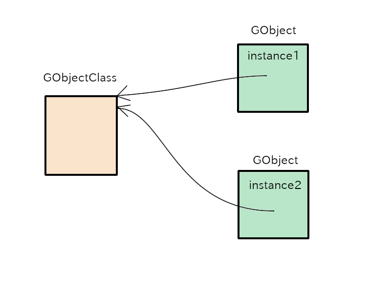

# GObject

## Class and instance

GObject instance is created with `g_object_new` function.
GObject has not only instances but also classes.

- A class of GObject is created at the first call of `g_object_new`.
And there exists only one GObject class.
- GObject instance is created whenever `g_object_new` is called.
So, two or more GObject instances can exist.

In a broad sense, GObject means the object which includes its class and instances.
In a narrow sense, GObject is a definition of a C structure.

~~~C
typedef struct _GObject  GObject;
struct  _GObject
{
  GTypeInstance  g_type_instance;
  
  /*< private >*/
  guint          ref_count;  /* (atomic) */
  GData         *qdata;
};
~~~

The `g_object_new` function allocates GObject-sized memory, initializes the memory and returns the pointer to the memory.
The memory is a GObject instance.

In the same way, the class of GObject is memory allocated by `g_object_new` and its structure is defined with GObjectClass.
The following is extracted from `gobject.h`.
But you don't need to know the details of the structure now.

~~~C
struct  _GObjectClass
{
  GTypeClass   g_type_class;

  /*< private >*/
  GSList      *construct_properties;

  /*< public >*/
  /* seldom overridden */
  GObject*   (*constructor)     (GType                  type,
                                 guint                  n_construct_properties,
                                 GObjectConstructParam *construct_properties);
  /* overridable methods */
  void       (*set_property)		(GObject        *object,
                                         guint           property_id,
                                         const GValue   *value,
                                         GParamSpec     *pspec);
  void       (*get_property)		(GObject        *object,
                                         guint           property_id,
                                         GValue         *value,
                                         GParamSpec     *pspec);
  void       (*dispose)			(GObject        *object);
  void       (*finalize)		(GObject        *object);
  /* seldom overridden */
  void       (*dispatch_properties_changed) (GObject      *object,
					     guint	   n_pspecs,
					     GParamSpec  **pspecs);
  /* signals */
  void	     (*notify)			(GObject	*object,
					 GParamSpec	*pspec);

  /* called when done constructing */
  void	     (*constructed)		(GObject	*object);

  /*< private >*/
  gsize		flags;

  gsize         n_construct_properties;

  gpointer pspecs;
  gsize n_pspecs;

  /* padding */
  gpointer	pdummy[3];
};
~~~

The programs for GObject are included in GLib source files.
You can download the GLib source files from [GNOME download page](https://download.gnome.org/sources/glib/).

There are sample programs in [src/misc](misc) directory in the GObject tutorial repository.
You can compile them by:

~~~
$ cd src/misc
$ meson setup _build
$ ninja -C _build
~~~

One of the programs is `example1.c`.
Its code is as follows.

@@@include
misc/example1.c
@@@

- 5-6: `instance1` and `instance2` are pointers that points GObject instances.
`class1` and `class2` points a class of the instances.
- 8-11: A function `g_object_new` creates a GObject instance.
GObject instance is a chunk of memory which has GObject structure (`struct _GObject`).
The argument `G_TYPE_OBJECT` is the type of GObject.
This type is different from C language type like `char`  or `int`.
There is *Type System* which is a base system of GObject system.
Every data type such as GObject must be registered to the type system.
The type system has series of functions for the registration.
If one of the functions is called, then the type system determines `GType` type value for the object and returns it to the caller.
`GType` is an unsigned long integer on my computer but it depends on the hardware.
`g_object_new` allocates GObject-sized memory and returns the pointer to the top address of the memory.
After the creation, this program displays the addresses of instances.
- 13-16: A macro `G_OBJECT_GET_CLASS` returns the pointer to the class of the argument.
Therefore, `class1` points the class of `instance1` and `class2` points the class of `instance2` respectively.
The addresses of the two classes are displayed.
- 18-19: `g_object_unref` will be explained in the next subsection.
It destroys the instances and the memory is freed.

Now, execute it.

~~~
$ cd src/misc; _build/example1
The address of instance1 is 0x55895eaf7ad0
The address of instance2 is 0x55895eaf7af0
The address of the class of instance1 is 0x55895eaf7880
The address of the class of instance2 is 0x55895eaf7880
~~~

The locations of two instances `instance1` and `instance2` are different.
Each instance has its own memory.
The locations of two classes `class1` and `class2` are the same.
Two GObject instances share the same class.

{width=10cm height=7.5cm}

## Reference count

GObject instance has its own memory.
They are allocated by the system when it is created.
If it becomes useless, the memory must be freed.
However, how can we determine whether it is useless?
GObject system provides reference count to solve the problem.

An instance is created and used by other instance or the main program.
That is to say, the instance is referred.
If the instance is referred by A and B, then the number of the reference is two.
This number is called *reference count*.
Let's think about a scenario like this: 

- A calls `g_object_new` and owns an instance G.
A refers G, so the reference count of G is 1.
- B wants to use G too.
B calls `g_object_ref` and increases the reference count by 1.
Now the reference count is 2.
- A no longer uses G.
A calls `g_object_unref` and decreases the reference count by 1.
Now the reference count is 1.
- B no longer uses G.
B calls `g_object_unref` and decreases the reference count by 1.
Now the reference count is 0.
- Because the reference count is zero, G knows that no one refers to it.
G begins finalizing process by itself.
G disappears and the memory is freed.

A program `example2.c` is based on the scenario above.

@@@include
misc/example2.c
@@@

Now execute it.

~~~
$ cd src/misc; _build/example2
bash: cd: src/misc: No such file or directory
Call g_object_new.
Reference count is 1.
Call g_object_ref.
Reference count is 2.
Call g_object_unref.
Reference count is 1.
Call g_object_unref.
Now the reference count is zero and the instance is destroyed.
The instance memories are possibly returned to the system.
Therefore, the access to the same address may cause a segmentation error.
~~~

`example2` shows:

- `g_object_new` creates a new GObject instance and sets its reference count to 1.
- `g_object_ref` increases the reference count by 1.
- `g_object_unref` decreases the reference count by 1.
If the reference count drops to zero, the instance destroys itself.

## Initialization and destruction process

The actual process of GObject initialization and destruction is very complex.
The following is simplified description without details.

Initialization

1. Registers GObject type with the type system.
This is done in the GLib initialization process before the function `main` is called.
(If the compiler is gcc, then `__attribute__ ((constructor))` is used to qualify the initialization function.
Refer to [GCC manual](https://gcc.gnu.org/onlinedocs/gcc-10.2.0/gcc/Common-Function-Attributes.html#Common-Function-Attributes).)
2. Allocates memory for GObjectClass and GObject structure.
3. Initializes the GObjectClass structure memory.
This memory will be the class of GObject.
4. Initializes the GObject structure memory.
This memory will be the instance of GObject.

This initialization process is carried out when `g_object_new` function is called for the first time.
At the second and subsequent call for `g_object_new`, it performs only two processes: (1) memory allocation for GObject structure (2) initialization for the memory.
`g_object_new` returns the pointer that points the instance (the memory allocated for the GObject structure).

Destruction

1. Destroys GObject instance. The memory for the instance is freed.

GObject type is a static type.
Static type never destroys its class.
So, even if the destroyed instance is the last instance, the class still remains.

When you write code to define a child object of GObject, It is important to understand the process above.
The detailed process will be explained in the later sections.
