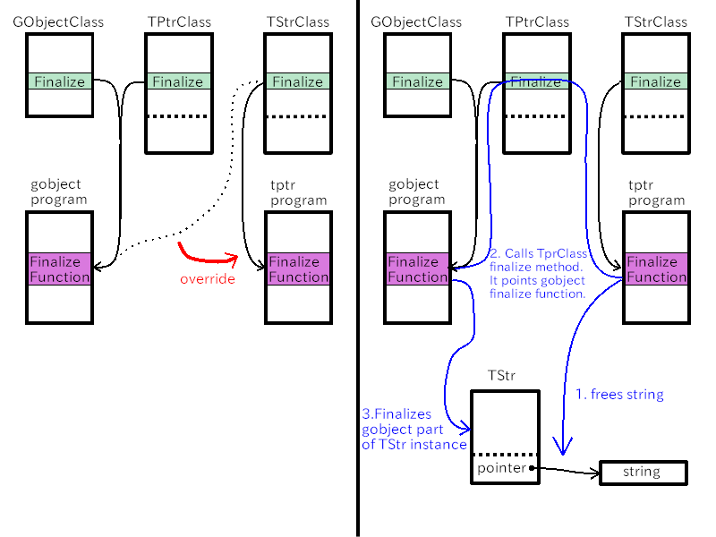

# String and memory management

The example in this section is TStr object.
TStr has a string type value and is a child object of TPtr.

It is similar to TInt or TDouble but C language String is more complex than int and double.
When you make TStr program, you need to be careful about memory management, which is not necessary in TInt and TDouble.
First two subsections are topics about string and memory.

## String and memory

String is an array of characters that is terminated with '\0'.
String is not a C type such as char, int, float or double.
But the pointer to an array behaves like a string type of other languages.
So, we often call pointers string when it points a character array.

If the pointer is NULL, it points nothing.
So, the pointer is not a string.
Programs with string will include bugs if you aren't careful about NULL pointer.

Another annoying problem is memory allocation.
Because string is an array of characters, memory allocation is necessary to create a new string.
We don't forget to allocate memory, but often forget to free the memory.
It causes memory leak.

~~~C
char *s;
s = g_strdup ("Hello.");
... ... ... do something with s
g_free (s);
~~~

`g_strdup` duplicates a string.
It does:

- Calculates the size of the string.
The size of "Hello." is 6.
- Requests the system to allocate 6 bytes memory.
- Copies the string to the memory.
- Returns the pointer to the newly-allocated memory.

If the string `s` is no longer useless, `s` must be freed, which means the allocated 6 bytes are returned to the system.
`g_free` frees the memory.

Strings bounded by double quotes like "Hello." is string literal.
It is an array of characters, but the contents of the array is not allowed to change usually.
And it mustn't be freed.

I wrote "usually".
There's an exception.
If an array is initialized with string literal, the array can be changed.

~~~C
char a[]="Hello!";
a[1]='a';
g_print ("%s\n", a);
~~~

First, the compiler calculates the length of "Hello!".
It is 6.
Then 6 bytes memory is allocated in static memory (static class array) or stack memory (auto class array).
The memory is initialized with "Hello!".
So, the string in the array can me changed.
This program displays `Hallo!`, not `Hello!`.

The following program is wrong and if you execute it, some bad things will probably happen.

~~~C
char *a = "Hello";
*(a+1) = `a`;
g_print ("%s\n", a);
~~~

In this program, "Hello" is not a static class array or an auto class array.
It might be in the program code area or some other non-writable area.
It depends on the implementation of your compiler.
Anyway, don't program like this.

## Copying string

There are two ways to copy a string.
First, copy the pointer.

~~~C
char *s = "Hello";
char *t = s;
~~~

Two pointers `s` and `t` points the same address.
This program is OK because string literal above never changes and never be freed.
But if the string is mutable or can be freed, a problem might happen.

@@@include
temp/foobar.c
@@@

When the function `func` is called, the copy of the pointer `s` is made and the copy is assigned to the parameter `string`.
Therefore, `string` is a copy of `s` and both pointer point the same string "Hello Foo!".
The function replaces `Foo` with `Bar` in the string pointed by `string`.
The modified string is also pointed by `s`.
Therefore, the output is "Hello Bar!", not "Hello Foo!".

If the string `s` is copied before the function call, "Hello Foo!" will be shown.

@@@include
temp/foobar2.c
@@@

The difference between copying a pointer and duplicating a string (an array of characters) is the same as shallow copy and deep copy in object oriented languages.
It's useful to learn shallow copy and deep copy.

The problem above often happens in function call.
Better designed function uses const qualifier.
It ensures that the string isn't changed in the function.

@@@include
temp/foobar3.c
@@@

## TStr object

TStr is a child of TPtr.
It holds a string value.
The pointer of the string is a "pointer" property of TPtr, which is a parent of TStr.
It has  a function `t_str_concat` which concatenates two strings of TStr objects and creates a new TStr object.

The header file `tstr.h` is as follows.

@@@include
tstr/tstr.h
@@@

- 8: TStr is a final type.
`G_DECLARE_FINAL_TYPE` is used.
- 10-11: `t_str_concat` concatenates two strings of `self` and `other`, then returns the newly created TStr instance.
- 14-18: Setter and getter.
- 21-22: `t_str_new_with_string (const char *s)` creates a new TStr object and set its value with `s`.
Because the parameter has const qualifier, it ensures that the string `s` never changes in the function.
- 24-25: `t_str_new` creates TStr that holds NULL pointer.

`tstr.c` is a C file of TStr object.

@@@include
tstr/tstr.c
@@@

- 3-5: TStr instance structure.
It only has its parent instance.
No its own area exists.
- 7: `G_DEFINE_TYPE` is used.
- 9-11: `t_str_init` does nothing.
The parent instance of TPtr initializes its pointer to NULL.
Therefore, the pointer of TStr instance is also NULL just after it is created.
- 13-20: `t_str_finalize` finalizes the instance.
This function is assigned to `class->finalize` in class initialization.
`t_str_finalize` frees the string pointed by the pointer of TPtr if it is not NULL.
After that it calls its parent's finalization method.
This is called "chain up to its parent".
This process is complicated.
It will explained later.
- 22-27: `t_str_class_init` initializes TStrClass.
It overrides `gobject_class->finalize` with `t_str_finalize`.
- 30-35: Setter.
`s` is owned by the caller.
`self` needs to own its string so it duplicates `s`.
After the duplication, `s` and `t` points different address.
So, the string pointed by `s` and another string pointed by `t` are different but the contents of both the string are the same.
Set the pointer of `self` with `t`.
- 37-46: Getter.
Gets the pointer from `self` and assigns it to `s`.
If `s` is string (not NULL), then duplicates it and returns it.
Otherwise, returns NULL.
- 48-68: `t_str_concat`.
It concatenates two strings held by `self` and `other`.
Because `t_str_get_string` allocates memory for strings `s1` and `s2`, they needs to be freed when they become useless.
- 55-62: Creates `s3`.
`g_str_concat` concatenates two strings and creates a new string.
- 63: Creates a new Tstr object with `s3`.
- 64-66: `s1`, `s2` and `s3` are now useless, so they are freed if they aren't NULL.
- 70-85: Creates new TStr instance.
Const qualifier is used in line 71.
This ensures the parameter `s` never changes in the function.

The "chain up to its parent" process is illustrated with the diagram below.
There are three classes, GObjectCLass, TPtrClass and TStrClass.
Each class has finalize method pointer which points finalize functions in gobject program or tstr program.
The finalize method of TStrClass finalize its own part of the TStr instance.
At the end of the function, it calls its parent's finalize method.
It is the finalize method of TPtrClass.
The method hasn't been overridden, so it points the finalize method in gobject program.
It finalizes the GObject part of the TStr instance.

`main.c` tests TStr object.

@@@include
tstr/main.c
@@@

- 5-15: Notify signal handler is almost same as before.
- 17-58: `main` function.
This function creates two TStr objects and concatenates them.
- 24-31: Creates `str1` and `str2`.
Connects "notify::pointer" signal to `notify_cb`.
Sets string of the instances with `one` and `two` respectively.
At the same time, "pointer" properties are set.
- 33: Concatenates `str1` and `str2`, then creates new object `str3`.
- 34-36: Gets strings from the TStr instances.
- 38-48: shows the strings.
- 50-55: Frees instances and strings.

## Compilation and execution

Compilation is done by usual way.
First, change your current directory to `src/tstr`.

~~~
$ meson _build
$ ninja -C _build
~~~

Then, execute it.

@@@shell
cd tstr; _build/tstr
@@@

The last line shows that "one" and "two" are concatenated.

You have probably been aware that strings make things complicated because of memory management.
However, strings are one of the most useful data structure in computers.
If you make child objects of GObject, the technique to manage strings will be necessary.
The important things are:

- Memory allocation and freeing.
Don't forget freeing.
- Think about what object or function owns a string and are responsible to free the string.
- Understand how to initialize and finalize an instance.
- Use const qualifier in your function if string parameters doesn't change in your function.
This is useful for users to know whether they should duplicate their strings.

